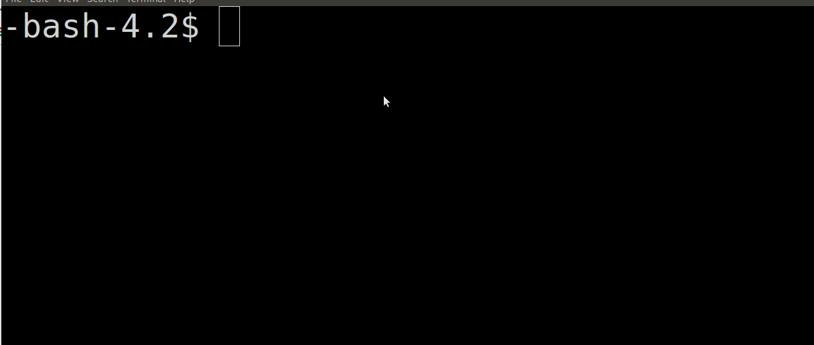

# README! 

**I strongly recommend** you do most of your testing on your own [linux virtual machine](https://www.google.com/search?rlz=1C1CHBF_enUS798US798&ei=t7GTXMb3JIOZ_QbEwZeYAg&q=setting+up+a+linux+virtualbox&oq=setting+up+a+linux+virtualbox&gs_l=psy-ab.3...7203.8384..8512...0.0..0.96.592.8......0....1..gws-wiz.......0i71j35i304i39j0i7i30j0i8i7i30j0i13i30j33i10.wdadpiXRdZ8) or [vagrant image](https://piazza.com/class/k4u736cjtm03bw?cid=17) you have previously setup. Executing a shell that forks indefinitely (i.e. a [fork bomb](https://en.wikipedia.org/wiki/Fork_bomb)) **slows down the servers for everyone** (and may prevent you from logging in). **I will not grant individual extensions because you blocked yourself and your classmates out from a shared resource.**

**Assignment Strategy**

You should be able to implement Part 1.1 and Part 1.2 of this assignment right away with a little searching on the [string.h](http://www.cplusplus.com/reference/cstring/) C library. **I strongly suggest that you complete Parts 1 and 2 as soon as possible,** to give you more time to reflect on your design to complete Part 1.3.

Part 1.3 will require some knowledge of commands like fork() and exec(). Make sure you understand fork and exec before beginning (see Lab 5).

# Introduction

For this assignment, you will be writing your very own shell-- the mini-shell!


[Shell's](https://en.wikipedia.org/wiki/Shell_(computing)) (or sometimes called command-line interfaces) are text based applications that serve as an intermediate between the user and the operating system. The shell is also a tool for how a user interacts with the operating system. Previously, we have written many scripts that our shell can execute by running various programs. The shell that you build with this assignment will be something you can continually expand on in the future, and perhaps distribute as your own one day! Let us take a closer look at the parts to get started.

# Part 1.1 - Lexer/Parser

For part one of this assignment, you will perform string processing to build a simple lexer. You have previously done some lexing and parsing with the cycle count tool using functions such as [strcmp](http://www.cplusplus.com/reference/cstring/strcmp/). The lexer we are building now would be similar to the first part of building a compiler or interpeter for a programming language. We will build on our lexer to create a shell, which can be thought of as an interactive interpreter of a command-line language performing the following:

1. It takes in a line of code (READ)
2. Breaks the line into tokens and parses the individual lexemes (EVALUATES)
3. Then executes the command and any arguments (PRINT output)
4. Then repeats (LOOP)

We call this a [REPL interpreter](https://en.wikipedia.org/wiki/Read–eval–print_loop)

For the first part of this assignment, we are going to break a string into individual tokens (or [lexemes](https://en.wikipedia.org/wiki/Lexical_analysis#Lexeme)).

- The first token will be the command
- The second through *N* number of tokens (i.e. lexemes) will be any number of arguments.
- (Optionally) The N+1 tokens through M tokens will be another command with arguments.

For those who like a more formal definition, a grammar describing how to break each string into individual lexemes looks like the following: 

```command [args]* [ | commmand [args]* ]*```

- *command* is what you type in (e.g. 'ls')
- *args* are any number of arguments (e.g. -l)
- And there may be a pipe ('|') sending our output elsewhere.
	- The pipe ('|') command means that we are taking the previous commands output as using that as input into our next command. 
- The star(asterisk) means that any number of arguments(zero to as infinite) could follow (See [Kleene star](https://en.wikipedia.org/wiki/Kleene_star)).

For part 1.1 of this assignment, write a program [parse.c](./parse.c) that contains a single function (there must be a function, do not implement everything in main) to lex a single line of input and and prints out the individual tokens. You may re-use as much as [parse.c](./parse.c) as you like for implementing your shell in part 1.3.

### Example output for Part 1.1

Your [parse.c](./parse.c) program is executed with a single string as an argument and the output is the folowing: 

1. *./parse "cd ."*
  - ```
    cd
    .
    ```
2. *./parse "ls -l"*
  - ```
    ls
    -l
    ```
3. *./parse "cat parse.c | head -n2"*
  - ```
    cat
    parse.c
    |
    head
    -n2
    ```
  
- **Note:** Your program will read in from the command-line the arguments to parse (e.g. *./parse "cat parse.c | head 2"*) 
	- **Hint:** Wrapping the command in quotes makes the first argument a string.
  
### Additional Hints for Part 1.1  
  
* The function [strtok](http://www.cplusplus.com/reference/cstring/strtok/) may be useful for splitting up a line of input.
  * `strtok` works by splitting up an input based on a delimeter that indicates a new token is starting(in our example a space). 
  * `strtok` is part of the [string.h](http://www.cplusplus.com/reference/cstring/) library, so be sure to include it. 
* You may use other strategies outside of strtok however--there are many ways to lex and parse your input.
* My expectation is Part 1.1 of this assignment should be relatively short and you may reused the functions for implementing the mini-shell!
  
# Part 1.2 - Signals (Reading--use this information for Part 1.3)

In your shell, you will have to implement a signal handler in order to give the user some control of processes that are runninng. We have very briefly discussed signal handlers, so make sure you are familiar with the concept. 

### What are signal handlers?

As a refresher, a [signal handler](http://www.gnu.org/software/libc/manual/html_node/Signal-Handling.html) is a software interupt that is sent to a process. Provided below is an example of sending a software interrupt to a process running a shell when you press `Ctrl+C`. Signal handlers are handy for communicating with the operating system how to handle a process that may be misbehaving, or perhaps to [handle some other event](http://www.gnu.org/software/libc/manual/html_node/Kinds-of-Signals.html#Kinds-of-Signals).

```c
#include <stdio.h>
#include <stdlib.h>
#include <signal.h> // This is new!


// Create a signal handler
void sigint_handler(int sig){
	// Ask yourself why is 35 the last parameter here?
	write(1,"Terminating through signal handler\n",35); 
	exit(0);
}

int main(){

	// Install our signal handler
	signal(SIGINT, sigint_handler);

	printf("You can only terminate by pressing Ctrl+C\n");

	while(1){
		printf("Running forever!\n");
		sleep(1);
	}

	return 0;
}
```

* The following page provides details about signals: https://ftp.gnu.org/old-gnu/Manuals/glibc-2.2.3/html_chapter/libc_24.html
* The following article provides a nice introduction as well: https://www.thegeekstuff.com/2012/03/catch-signals-sample-c-code/

# Part 1.3 - Mini-Shell



You are now ready to create Mini-Shell in [shell.c](./shell.c). Implementing a shell will teach you the fundamentals of how an operating system executes and controls new processes. The shell after all is our window into the operating sytsem. The Mini-Shell which you will be implementing is inspired by other popular shells! 

At a high level, implementing mini-shell takes the following components:
1. You will have a function that reads in commands a user types.
2. Your program will execute in an infinite loop.
3. Your program will execute child processes from the shell (the shell is the parent process) based on the command.

## The specifications for your shell

1. **You must have a prompt "mini-shell>" in front of each command that is typed out.**
	- (If you want to be creative you can include the machine name or other information you can derive, but the prompt **MUST** end in "mini-shell>").
2. **The maximum input size(i.e. BUFFER SIZE) on a given line will be 80 characters for our shell. You can specify this as a constant global variable.**
3. **Implement a signal handler so when the user presses 'Ctrl+C' the text 'mini-shell terminated' is printed out.**
	- Make sure that all child processes are terminated when this occurs!
4. **When you launch a new child process from your shell, the child process should run in the foreground by default until it is completed.**
	- Here are some examples: https://www.tutorialspoint.com/unix/unix-processes.htm
5. **If the user adds the pipe '|' then the output of one process should be the input to the next process.**
	- You can assume only one '|' will be used at most. e.g. `ls -l | wc`
	- As a hint, it can be helpful to have a separate function or use case that handles parsing a series of commands if a pipe is found when parsing the individual tokens.
	- Here are some examples: https://www.tutorialspoint.com/unix/unix-pipes-filters.htm
	- You may not use this specific [system](http://man7.org/linux/man-pages/man3/system.3.html) command (named *system()*) which makes handling pipes trivial. You must investigate [dup](https://linux.die.net/man/2/dup) and file descriptors.
6. **Your shell should have some built-in functions that you will have to implement (i.e. functions written in C code). These include `exit` to terminate your shell, `cd` so you may change directories, and `help` explaining all the built-in commands available in your shell.**
	1. You can test `cd` by moving up or down the directory tree.
		- (Hint the C library has commands for this)
	2. `help` should print out all of the built-in commands that you provide (including your user made one).
	3. `exit` should terminate the shell 
		- Note: If you launch another shell from within your shell, exit should only close out of the most recently launched shell.
7. **You will want to think about how to store these built-in commands.**
	- I will hint that using an array with commands and an array of function pointers is one possibly effective solution.
	- What is a function pointer? https://www.geeksforgeeks.org/function-pointer-in-c/
	- You can further think about what an array of function pointers looks like and why this may be appropriate.
8. **If a command is not found, your shell should print out an error message, and resume execution.**
	- e.g. `mini-shell>Command not found--Did you mean something else?`
9. **You need to implement and document 1 addditional built-in command that you choose here.**
	1. This built-in command can be of your choosing, but should not be trivial (i.e. not just print a message or clear the screen).
		- An example might be 'history' which stores all of the previous commands a user has typed in and prints them out.
		- Another example may be when the user presses 'tab' a list of programs that can run are found.
		- You can be creative here. The constraint is that you are implementing this functionality in C, and not calling a script.
		- Your built-in command should print out as a command that can be used when the user types `help`
	2. (Edit the readme below with your built-in command)

-----------------------------------------------------
NAME: 

*edit me*

SYNOPSIS: 

*edit me and add in a short description of the command and its usage*

DESCRIPTION:

*Write a longer description of what he command does*

NOTES:

*Enter two or three sentences (minimum) in how you implemented the built-in command.*

-----------------------------------------------------

## Some helpful things to ponder

1. You are running programs in your shell. The programs that are being run are found in the `bin` directory. For example, you would find a program called `cat` or `ls` there, which someone wrote in C for you.
2. There exists more than 1 [exec](https://linux.die.net/man/3/exec) command -- some are helpful for finding things on your [environment path](https://en.wikipedia.org/wiki/PATH_(variable)). Hmm!
3. You can also execute programs from a relative or absolute filepath (e.g. `./minishell`)
4. There is not a program called 'cd' in the 'bin' directory, which means it must be built into the actual shell.
	- Think about whether this would make sense to execute in the parent or child process and why.

Provided below is an example for program that forks a new process, executes it, and then resumes execution.

```c
#include <stdio.h>
#include <stdlib.h>
#include <sys/types.h>
#include <unistd.h>
#include <sys/wait.h>

int main(){

	char* myargv[16];
	myargv[0]="/bin/ls"; // Try changing this to "ls" Will the program work?
			     // Note: There are many versions of exec that will look in
			     //	      environment variable paths. See execvpe for example.
	myargv[1]="-F";
	myargv[2]=NULL; // Terminate the argument list
	
	if(fork()==0){
		// Executes command from child then terminates our process
		execve(myargv[0],myargv,NULL);
		printf("Child: Should never get here\n");
		exit(1);
	}else {
		wait(NULL); // This call makes the parent wait on its children.
	}

	printf("Finally, print from the parent\n");
	
	return 0;
}
```

### How do I test mini-shell?

The good news is you can validate the behavior of your shell against the Unix terminal to ensure it is working. Some samples you can reasonably test when getting started are the following:

```bash
cat parse.c
nl parse.c
ls -l
pwd
cd .
pwd
nl parse.c | wc -l
cat parse.c | head 2
./mini-shell # Running a mini-shell within a mini-shell and then executing commands
cd ..
```

# Rubric

<table>
  <tbody>
    <tr>
      <th>Points</th>
      <th align="center">Description</th>
    </tr>
    <tr>
      <td>10% (Part 1.1 - Lexer)</td>
      <td align="left"><ul><li>Completed Lexer with a function to parse</li></ul></td>
    </tr>
    <tr>
      <td>90% (Part 1.3 - Mini-Shell)</td>
      <td align="left"><ul><li>15% 1 Built-in command of your choice<li> 5% documentation of this command<ul><li>e.g. A 'clear' or print command will not earn full marks. Do something creative! (Search the web for examples, look at other shells like the 'fish shell')</li></ul></li><li>20% 3 built-in commands (cd, help, exit).</li><li>5% A working signal handler.</li><li>20% A shell that runs forever and has the 'mini-shell>' prompt and properly parses programs.<ul><li>You should avoid [fork bombs](https://en.wikipedia.org/wiki/Fork_bomb). As you are learning the fork command, it will be helpful to test on virtual machine or vagrant image as opposed to the Khoury servers. :)</li></ul></li><li>25% Can successfully execute processse in the foreground (10% for a working pipe.)</li></ul></td>
    </tr>    
  </tbody>
</table> 


# Resources to help

- (See links above)
- (See the SupportCode) folder
- And otherwise think about commands like fork, execvp, wait, waitpid, getpid, etc. :)
- [man 2 pipe](http://man7.org/linux/man-pages/man2/pipe.2.html)
- [dup](http://man7.org/linux/man-pages/man2/dup.2.html)

### Glossary and Tips
1. Commit your code changes to the repository often.  This is best practice.
2. **Do not commit your .o file or your executable file to the repository.** This is considered bad practice!
3. On Functionality/Style
	1. You should have comments in your code to explain what is going on, and use good style (80 characters per line maximum for example, functions that are less than 50 lines, well named variables, well named functions etc.).
4. You may use any stdio.h functions that are useful, such as getline. You are welcome to implement these functions from scratch if you like however.
	1. You will want to include 'signal.h' as well for your signal handlers.
5. Careful when parsing. Things like newline characters '\n' like to sneak in and may make it difficult for strcmp to provide accurate results. "teststring" != "teststring\n"	

# Going Further

You might consider some of the following optional features in your shell.
1. Switching processes between forground and background (fg and bg commands).
2. Handling the '|', pipe  between an arbitrary number of processes.
3. Handle tab completion or moving through the history of commands with arrowkeys (This is a good example of a built-in command).

# Feedback Loop

(An optional task that will reinforce your learning throughout the semester)

Implementing a shell is one of the more fun exercises in learning C programming (in my opinion). However, it is quite relevant, especially in the context of the web browser and other applications (video games for example, often have a real-time shell interface for debugging).

Choose one of the following 3 papers to skim, and you can add notes here with two interesting things you discovered (Note this is not graded and completely optional).

- Grocoli: https://dl.acm.org/citation.cfm?id=2442019
- Integrating Command Shell in Web Browser: https://www.usenix.org/techsessionssummary/integrating-command-shell-web-browser
- Inky: http://people.csail.mit.edu/emax/papers/uist08-inky/uist08-inky.pdf

# F.A.Q.

- Q: Do I have to implement every shell command?
- A: No--that would be completely unreasonable! Think about how the 'exec' family of commands work and PATH. You are only implementing a few built-in commands that will execute. If a command is not a built-in command, then you attempt to execute linux programs found on PATH.
