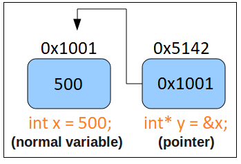

# Terminal Scripts and Linked List
> "A first non-trivial data structure"


## Introduction

Previously we have learned how to work with the terminal. Today we are going to connect a way to download some data using terminal commands and work with that data in the C programming language.

## Data Structures

### Static Arrays

Data structures are a way for us to store information. Most programming languages come with support for an 'array' data structure for instance. As a reminder, an array is a data structure which stores homogenous datatypes in a contiguous piece of memory. That is a fancy way of saying:

```cpp
int array1[100]; // This array holds strictly integers.
unsigned int array2[100]; // This array holds strictly unsigned ints.
float array3[100]; // This array holds strictly floats.
```

Arrays can be *statically allocated*. That is, at compile-time (before a program is run), we know exactly how much memory is required to store the contents of the array in memory.

Here are some examples of statically allocated arrays:
```cpp
int numbers[10];	// 'numbers' is large enough to store exactly 10 integers (10 integers * 4 bytes = 40 bytes).
char firstName[15];	// 'firstName' stores up to 15 char's (15 chars * 1 byte per char = 15 bytes)
float decimalNumbers[5000];	// 'decimalNumbers' holds up to 5000 floating point numbers.
```

Again, the *statically allocated* portion means that there is a fixed number of elements in the arrays. This value is decided when we write our source code and compile it at compile-time.

### Dynamically Allocated Arrays with malloc and free

Often however, we may not know how many elements we want to store in an array. We will only know how big to make the array while the program is running--that is at *run-time* we set the size of the array. [malloc](http://man7.org/linux/man-pages/man3/malloc.3.html) is the C-library function (included in the the <stdlib.h> file) that allows us to do this. Here is an example of malloc working (and us also remembering to free our memory).

```c
#include <stdio.h>
#include <stdlib.h> // includes malloc/free


int main(){

    int sizeOfArray = 0;
    printf("How many elements would you like in your array?");
    scanf("%d",&sizeOfArray);

    // Create our array at run-time.
    // We are allocating this array in heap memory.
    // Heap memory 'persists' until we 'free' the memory.
    //
    // Note we do not know the 'sizeOfArray' until
    // we read the user input. This is useful, because
    // we may not know the size of a dataset for examlple.
    int* myArray = (int*)malloc(sizeof(int)*sizeOfArray);

    // Initialize our array items, for now a simple loop.
    int i=0;
    for(i=0; i < sizeOfArray; ++i){
        // Access each element in array as we
        // have previously done.
        myArray[i] = i;
        printf("myArray[%d]=%d\n",i,myArray[i]);
    }

    // The free function reclaims any memory we have
    // allocated on the heap.
    free(myArray);

    return 0;
}
```

### Dynamic data structures

One tricky thing with dynamically allocated arrays however, is that if we have to expand or reduce the size of them, this involves having to allocate a new array, and then copy the elements over one at a time. This can be expensive in terms of performance if we have to do this frequently. For this problem, a data structure that can expand and contract more incrementally can be very efficient in terms of time and space (And we want to be efficient as we only have a finite amount of memory on our computers).

For today's lab, we will be implementing a data structure known as the **singly linked list** that can expand or contract one item at a time. This exercise will give you practice with:

1. struct's
2. pointers
3. file I/O
4. Connecting our previous work with bash scripts to C programs

# Part 0 - SSH and git pull

0. Make sure you have accepted the invitation to the repo from the lab 2 web page.
1. Open a terminal and ssh into the Khoury servers ``` ssh khoury_user_name_here@login.khoury.neu.edu ```
2. Navigate to the directory where you store all the repos for this class (Use the `cd` command to change directory, `ls` to see files, and `pwd` to see your path)
3. Run ```git clone <newly_created_repo_url>``` This will add all of the files I have previously pushed into a new  repository.

If for some reason you are having trouble, you can always create a new copy of your repo by running `git clone <newly_created_repo_url>` in a separate directory.

# Part 1 - Understanding a struct - Creating Custom Data Types

A struct is a user defined data type (i.e. it does not exist natively in C) that stores multiple pieces of data. We call this a composite data type. Here is an example of a struct in C:

```cpp
  // The keyword 'struct' is followed by our new data type name.
  struct Student{
    int age;      // A field called 'age' that holds integer values is stored.
    int userID;   // An additional field 'userID' also holds integer values.
  };
  
  // Using the struct
  int main(){
    // We create a new struct named 'mike'
    // Note the 'struct' keyword is followed by the data type we defined above.
    struct Student mike;
    // We set the fields for our variable 'mike', which were previously not initialized.
    mike.age = 100;
    mike.userID = 123456789;
  
    return 0;
  }
```

## typedef struct 

If you noticed in our example where we created a student, we had to type `struct Student` which can become cumbersome to type. So we can use another C language keyword to save us some typing. Observe the change in line '3' with the word [typedef](https://www.tutorialspoint.com/cprogramming/c_typedef.htm). Next observe line '6' with 'Student_t'. This gives us a new type name that we can use within our main program, instead of constantly typing out `struct Student mike` we instead type `Student_t mike`

**Note**: Giving our Student type a suffix of `_t` is a standard practice that indicates this is custom struct

```cpp
  // The C language keyword 'struct' is followed by our new data type name.
  // We now have a new datatype called 'Student'
  typedef struct Student{
    int age;      // A field called 'age' that holds integer values is stored.
    int userID;   // An additional field 'userID' also holds integer values.
  }Student_t;
  
  // Using the struct
  int main(){
    // We create a new struct named 'mike'
    // Note the 'struct' keyword is followed by the data type we defined above.
    Student_t mike;
    // We set the fields for our variable 'mike', which were previously not initialized.
    mike.age = 100;
    mike.userID = 123456789;
  
    return 0;
  }
```

# Part 2 - Understanding Pointers



A pointer is a variable that points to an address in memory. That is, it stores an 'address' in memory as its value.

Here are some examples in a program you can type out and run.

```cpp
#include <stdio.h>
  
// Using the struct
int main(){
	// A regular variable	
	int x = 10;
	// A pointer that points to 
	// where 'x' is stored in memory.
	// Think of the data type as 'int*' 
	// (i.e. the asterisk or star is stuck to the data type)
	int* pointer_x = &x;
	// So if we print out the value we should get some
	// address in memory.	
	// (Note: You can google what %p is doing)
	// (	  Why do you think we had to cast the value?)
	printf("pointer_x value: %p\n",(void*)pointer_x);

	// Here we 'dereference' pointer_x to extract the value
	// of the 'thing' it points to. That is, what is the value
	// that exists at its address.
	printf("dereferencing pointer_x gives us %d\n",*pointer_x); 

	return 0;
}
```

## Chaining pointers together

1. So we know a pointer stores an address. 
2. A pointer is indirectly pointing to a value of a specific data type.
3. we can access the value of that data type by dereferencing the pointer. 

We can use pointers to create 'linked data structures' by chaining pointers together. This requires a struct that holds some data, and then a pointer to the next struct. Let's read on to learn about a new data structure!

# Part 3 - The Linked List

In our previous examples(Part 1) we created a 'Student'. Using what we learned in Part 2 about pointers, we can link all of the students together using a new data structure--the linked list.

The linked list is a data structure that can grow or expand. The way in which it does this is by 'pointing' to other nodes and forming a chain (You can think of this as holding hands with someone next to you, and then them holding hands with someone else next to them, etc.). This is advantageous when compared to an array, because we can add or remove links as we need them--thus we do not have to guess the size of data we need. We can simply add a new link in our linked list as we need one.

Conceptually a linked list is a custom composite data type typically called a 'node' that stores some data, and the location of the next node (A "composite data type" is a fancy way of saying a *struct* which contains many different pieces of data).

(Image from zentut)


From a coding perspective, a node_t struct may look something like this.

```cpp
typedef struct node{ // Note typedef saves us some typing so we do not have to type 'struct' everytime.
    int myData;
    struct node* next;
} node_t;	// Here is where the 'typedef' name is specified as 'node_t'
```

Everytime we create a node, we point the 'next' pointer to that node. This stores the location of the next node.

(Image from zentut)
(Note the first node is typically called the 'head' and the end is the 'tail')


Here is one example of a singly linked list that exists in stack allocated memory.

```cpp
#include <stdio.h>

typedef struct node{
	int myData;
	struct node* next;
}node_t;
  
// Using the struct
int main(){

	// Create a first node
	node_t node1;
	node1.myData = 100;
	// Create a second node
	node_t node2;
	node2.myData = 200;

	// Link together the nodes
	// node1 points to the address of node2
	node1.next = &node2;
	// node2 does not have a next node, so set it to 
	// NULL.
	node2.next = NULL;	

	return 0;
}

```
Note, that we are not doing anything fancy(i.e. using 'malloc' or 'free) in the above example regarding how we create the nodes. Thus these variables are stored on the stack.

## Iterator Pattern

Now what if we want to traverse the linked list?

We can do so by using an 'iterator' pattern. That is, we use a temporary node that points to each node. The 'iterator' then hops from the current node_t to node_t.next each iteration until *next* it is NULL.

Here is an example you can try to program. This one is also fun to draw out on paper to understand how it works.

```cpp
#include <stdio.h>

typedef struct node{
	int myData;
	struct node* next;
}node_t;
  
// Using the struct
int main(){

	// Create a first node
	node_t node1;
	node1.myData = 100;
	// Create a second node
	node_t node2;
	node2.myData = 200;

	// Link together the nodes
	// node1 points to the address of node2
	node1.next = &node2;
	// node2 does not have a next node, so set it to 
	// NULL.
	node2.next = NULL;	

	// iterating through the nodes
	node_t* iterator;
	// point to the first node (i.e. the head of the list)
	iterator = &node1;
	// While the iterator is not NULL, continue
	while(iterator != NULL){
		// Print myData, which is the head in the first iteration.
		printf("%d\n",iterator->myData);
		// Then move our iterator to whatever our 'next' node is in the linked list.
		iterator = iterator->next;
		// If our iterator is NULL, this loop terminates.
	}

	return 0;
}
```


# Part 4 - The task--linked list populated with real world data

Our goal is going to be to bring in some data from the real world, and then load it into our C programs using some basic File I/O operations.

## First task - obtain some data

Provided within the lab is a shell script ([data.sh](./data.sh)) to obtain some real world data. You should type in the example shell program provided below into [data.sh](./data.sh) to learn some new terminal commands.

```shell
# Boston Red Sox win column selector (Now you know about wget, cut, tail, and output)
wget -O - http://www.mshah.io/comp/Fall18/Systems/Lab/2/baseballdata.csv | cut -d ',' -f 5 | tail -n +2 > data.txt
```

- [wget](https://linux.die.net/man/1/wget) is a program for connecting to online resources and grabbing data (curl is another helpful program)
- [cut](https://linux.die.net/man/1/cut) is a program for 'selecting' a column of data.
- [tail](https://linux.die.net/man/1/tail) is a program that retrieves the last *n* lines of a file (head returns the first *n* lines)
- The final `>` mark outputs the file as a .txt file.
- In between each command there is a pipe `|` which gets the output from one command, and makes it the input to the next command.

## Second Task - File I/O

Now that we have some data, let us actually connect what we have done with our script, to working with the data in our program.

Fill in [readfile.c](./readfile.c) with the following example to get an introduction to basic file input/output in C.

```c
#include <stdio.h>
#include <stdlib.h>

int main(){

    // A pointer to a file
    FILE* myFile;

    // We point our file pointer to a file
    // The filepath is 'relative' to where we are
    // i.e. the './' means start searching for files here.
    // So we look for our 'data.txt' that has the Red Sox data.
    myFile = fopen("./data.txt","r");

    // We should check if we successfully opened the file next.
    // Because this is a 'file pointer' we can check if the
    // operation was successful against NULL.
    if(NULL == myFile){
        fprintf(stderr,"data.txt not found, did you run data.sh?");
        fprintf(stderr,"note: stderr argument means we write to a special 'error' output stream.");
        fprintf(stderr,"Program terminating now...");
        exit(1);
    }

    // If we have successfully opened our file, we can now read each line.
    // We will read each line, until we reach the end of the file (EOF).
    char buffer[255]; // At most, each line in file can be 255 characters
    // So we will now can each line from a file(fscanf),
    // and store it as a character string(%s) in buffer each iteration.
    while(fscanf(myFile, "%s", buffer) != EOF){
        printf("Red Sox wins are: %s\n",buffer);
    }

    // Finally, we will close our file
    fclose(myFile);

    return 0;
}
```


## Task 3 - Read and store data

Your third task is to read in the data you have generated and store it in a linked list. You will be modifying the [linkedlist.c](./linkedlist.c) file.

Your guidelines for this task are:
1. Write a function (create_list) that creates a Linked list and reads data line by line from a text file. 
	1. *Hint* This means within your function you must allocate on the heap.
2. Create a second function (print_list) that iterates through the linked list and prints out the data.
	1. The data should be output it in some meaningful way.
3. Write a third function(free_list) that free's your linked list.
	1. This means you are calling 'free' on each node you have malloc'd. Think carefully about how to do this. How will you know this works?
4. (Optional) You may create any helper nodes that you need.

### Example output with redsox data

Here is an example output of a program (criteria two from task 3) of the output:

In our print_list function, you will traverse(i.e. iterate) through the linked list and print out the following data.

```
101 wins -- This was a good year.
93 wins -- This was a good year.
93 wins -- This was a good year.
78 wins -- We did okay.
71 wins -- This was a bad year.
// etc.
```

**Hints**
- What does this code do? ``` node_t* new_node = (node_t*)malloc(sizeof(node_t));```
- Would it be useful to make a ```node_t* create_node(int data, node_t* next)``` function?
  - You may use the http://www.zentut.com/c-tutorial/c-linked-list/ resource as a reference. Cite sources in your source file if you use them.
- Depending on the data you read in, make sure it is either text or integer based--adapt your function signatures as needed (for red sox wins, I recommend integer, although an 'unsigned char' might be the most space efficient as baseball teams cannot win more than 255 games in a season).

# Compiling and Running your program

In order to run your program

1. Make sure to run the `sh data.sh` first.
2. `clang linkedlist.c -o linkedlist`
3. `./linkedlist`

# Deliverable

- Modify the file called [linkedlist.c](./linkedlist.c) and [data.sh](./data.sh) demonstrating an example of a linked list following the guidelines in Part 4.
	- Your data should print out in the displayed order, and not contain extra nodes.

# More resources to help

- Structs: https://www.tutorialspoint.com/cprogramming/c_structures.htm
- Pointers: https://www.tutorialspoint.com/cprogramming/c_pointers.htm
- Linked List: http://www.zentut.com/c-tutorial/c-linked-list/ or https://www.cprogramming.com/tutorial/c/lesson15.html
- Typedef: https://en.wikipedia.org/wiki/Typedef
