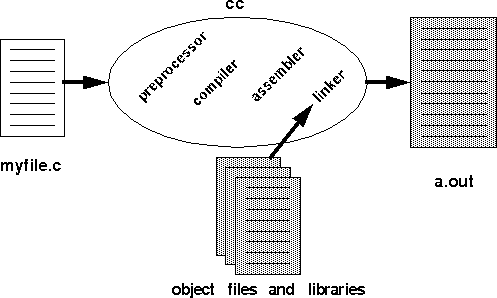

# Linker - "Respect the Linker"

In today's lab we will start by building a library with our compiler. Then we are going to exploit how the linker works to perform a little trick. This trick will also expose you briefly to the field of computer security, and just how fragile systems really are!

# Part 1 - Making a library

A linkers overall job is to 'glue' code together. With that in mind, let's make our first shared object file (i.e. a library).

1. First take a look at the *lottery.c* program located in this repository.
	- [lottery.c](./lottery.c) is a program that generates the four random numbers used in the mega-millions lottery. 
	- This program is a top secret program! This program is so top secret, we would not want to let anyone know about how the random numbers are generated.
2. Next compile and run the program lottery to generate the mega-millions number.
	- `gcc lottery.c -o lottery`
3. **Uh oh**, *you should be getting some linker error messages like this* -- We forgot to link in our library!

```
/tmp/lottery-2362b1.o: In function main:
lottery.c:(.text+0x58): undefined reference to TopSecretGenerateRandomNumber
lottery.c:(.text+0x87): undefined reference to TopSecretGenerateRandomNumber
lottery.c:(.text+0xb6): undefined reference to TopSecretGenerateRandomNumber
lottery.c:(.text+0xe5): undefined reference to TopSecretGenerateRandomNumber
clang: error: linker command failed with exit code 1 (use -v to see invocation)
```

Let us investigate more closely the [lottery.c](./lottery.c) file to see what is going on. Look for the function `TopSecretGenerateRandomNumber()` function near the top of the source code.

```c
// This function is external to our
// code, but will be found by the linker
extern int TopSecretGenerateRandomNumber();
```

The declaration of *TopSecretGenerateRandomNumber* (without the body i.e. the definition) is given at the top of lottery.c. This provides the compiler information about how the function can be used, and it is also making visible to our program that this function exists. The `extern` makes this a little more explicit that the function is located externally to our current source code file, but by default every function you create has 'extern' appended in front. Once the linker brings in all of the object files and dynamic libraries, the definition of this function must be found.

So instead of compiling and runnnig, let's generate a .o file:

1. Run `gcc -c lottery.c` on the terminal.
2. `lottery.o` should be generated (Run `ls` on the terminal to confirm).

Because we are only buildng the object file our program is only going through the process of compiling the code (i.e. checking that it is valid c syntax that is then transformed to machine code).  We will next confirm that external function (`TopSecretGenerateRandomNumber`) is undefined (i.e. there is no code that defines what the function should do, only a function declaration).

## Objdump

1. Run `objdump -t lottery.o` (-t instructs objdump to output the symbol table)
2. This will inspect the symbols found within the lottery.o file that was generated. 
	- Take a look at the output from objdump.
	- Can you confirm TopSecretGenerateRandomNumber is not defined? 

```
0000000000000000         *UND*	0000000000000000 TopSecretGenerateRandomNumber
0000000000000000         *UND*	0000000000000000 fflush
0000000000000000         *UND*	0000000000000000 printf
0000000000000000         *UND*	0000000000000000 srand
0000000000000000         *UND*	0000000000000000 stdout
0000000000000000         *UND*	0000000000000000 time
```

Remember that the `-t` symbol is outputting the symbol table. This is a list of functions and other symbols that are found in the object file. The meanings of each of the columns can be uncovered by running `man objdump` and then scrolling to see what **-t** means. The manual page will provide some insight into what *UND* means--though you may be able to infer it from this discussion.

## Modularity (Shared object files (.so))

Okay, so perhaps some savvy programmers has defined this `TopSecretGenerateRandomNumber()` function somewhere. Afterall, splitting your code into libraries and making your functions modular is a good practice. And there are many lotteries after all, so they probably made this function into a shared library for others to use. A benefit with only distributing a library, is that we can also hide the `TopSecretGenerateRandomNumber()` function so no one can see the algorithm for our random number generation.

Upon investigatating the contents of this folder, I find a file called **libsecret.so** (The .so extension is for Linux shared object file--this is a library). There is no source code however, so let us do two things.

1. Run `file libsecret.so`
	- I want to confirm that this is indeed some shared library that gets dynamically linked when another program is running.
	
```
libsecret.so: ELF 64-bit LSB shared object, x86-64, version 1 (SYSV), dynamically linked, BuildID[sha1]=9befd859fdec49f6af9da4afe60a62d59474d13e, not stripped
```

If you look carefully, you will see the words *dynamically linked* along with some additional information provided from the file utility.

1. Run `objdump -t libsecret.so` to investigate. 
	- **Discuss with a classmate** what are some of the functions you see being used in this library? Are you able to find our TopSecretGenerateRandomNumber()?

### More on the symbol table

```
0000000000000000 g     F .text	0000000000000015 TopSecretGenerateRandomNumber
0000000000000000         *UND*	0000000000000000 rand
```

- The *g* means that the symbol is external
- The F .text means there is a function found in the .text section of the object file.
	- (Remember that our actual code/instructions are in the .text section)

### Creating a shared library

In order to create a shared object file such as libsecret.so, we would use:  

`gcc -fPIC -shared secret.c -o libsecret.so`.  

This instructs the compiler to generate code(From the file secret.c) in such a way that it is more easily relocatable. That way the linker can glue in the addresses of functions like *TopSecretGenerateRandomNumber* into other programs.

## Continuing our investigation

In order to generate libsecret.so, we would need to find the associated secret.c. Unfortunately, we do not have it. (Well, there is in the 'hidden' folder of this lab if you really want to look, but pretend it does not exist or is otherwise hidden from us).

The good news is we were able to confirm a a function called *TopSecretGenerateRandomNumber* is available in libsecret.so. Perhaps we can link this in to successfully compile our lottery program!

## Linking two .o files

Let us now try to compile our lottery.c with the library that contains the functions definitions we need. This should ensure all of the functions are defined and available to be put into one final executable object file.

1. Try `gcc lottery.c libsecret.so -o lotto`
	- Ah ha, no errors! (Or at least none that were planned!)
2. Let us try to run `./lotto`
	- `./lotto: error while loading shared libraries: libsecret.so: cannot open shared object file: No such file or directory`
	- Hmm another error, but we can see libsecret.so within our current directory. 
	- I thought we did everything right?
	- Let's continue onwards!

### Introducing ldd

There is a nice tool that can help us debug linker errors called ldd. ldd prints out shared library dependencies. Investigate with `man ldd` to see the general description.

```
LDD(1)                                        Linux Programmer's Manual                                        LDD(1)

NAME
       ldd - print shared library dependencies
```

1. Let us go ahead and run `ldd ./lotto`
	- What libraries do you see?
	- This will tell us what libraries were found and not found.
	- If we look below, we see lib.c for example (The standard C programming library) was found.
	- But unfortunately, no libsecret.so is found, even though it is needed!
		- The good news however, is the linker knows we need the file--we simply need to find it.	
```
	linux-vdso.so.1 =>  (0x00007ffeec3df000)
	libsecret.so => not found
	libc.so.6 => /lib64/libc.so.6 (0x00007ffb2b93c000)
	/lib64/ld-linux-x86-64.so.2 (0x00007ffb2bd18000)
```

#### A way to link in files

Okay, so let us add our library to a *path* where it can be found (it is in the same folder afterall though...) When our linker is trying to find shared libraries at runtime, our linker searches in a few directories for shared libraries. One of the directories that it looks at, is set by an [environment variable](https://en.wikipedia.org/wiki/Environment_variable) from the system (An environment variable is essentially a global variable the entire system knows about, and is often used for various configuration settings). In this case the environment variable we care about is called LD_LIBRARY_PATH (i.e. "Load Library Path" tells us where to look for these .so files on Linux). 

1. Now where we want to look, is in the current directory.
2. So if we run our executable instead with: `LD_LIBRARY_PATH=. ./lotto`
	- Notice the subtle **.** (dot) right after the equals sign?
	- That adds the current root directory to the search path for libraries to be dynamically linked in.
3. Then tada! Finally we see our output!
	- Run this line a few times when you are confident it will work, and then continue onwards.

## Bigger problem -- I never win the lottery!

Now the lottery folks are protecting this `./lotto` program that I have shared with you. It is very secret. Unfortunately, I have never won the lottery, and today I (we) would like to win. With what we have learned about linkers--we can hack the lottery!

1. Write a program called [hack.c](./hack.c) that is the following.
	```c
	#include <stdlib.h>

	// Our version of the random number generator
	int TopSecretGenerateRandomNumber(){
		return 42;
	}
	```
2. Compile it as a shared library: `gcc -shared -fPIC hack.c -o libhack.so`
	- Note: the `-fPIC` creates position independent code
	- `-shared` makes this a shareable library as opposed to static
3. Now here is **the trick**.
	- The order in which the linker searches for shared libraries starts by searching the previous command we used (i.e. LD_LIBRARY_PATH). However, we can point the linker (i.e. force the linker to follow our search order) to load some libraries first. As the linker searchers, it will be satisfied once it finds all of the libraries it needs when resolving undefined references and then it will end its search.

## LD_PRELOAD -- the hack

Let us preload our 'hack' library to help us win the lottery.

1. What we are doing is exporting another environment variable on the terminal. 
	- Note that with [export](https://stackoverflow.com/questions/13046624/how-to-permanently-export-a-variable-in-linux), this preserves a change in our environment for the current session.
2. On the current terminal type: `export LD_PRELOAD=$PWD/libhack.so lotto`
3. (Build the hack source code into a library if you have not previously done so.)
4. Now run again once again with: `LD_LIBRARY_PATH=. ./lotto`
```
	And the winning numbers are...
	42
	42
	42
	42
	42 42 42 42...who would have guessed!
```

**Wait a second as the audience gasps...it looks like something is wrong with the lottery!**

So as we are noticing, the linker is quite powerful! But this also teaches us one of the weaknesses of shared libraries, because they are allowed to be preloaded before runtime. This trick can often be quite handy for debugging purposes as well (i.e. maybe we want to try a test function when debugging that prints additional information).

This little hack is quite powerful in the sense that we can redefine the behavior of any C-library function. We could for example write our own memory allocator(i.e malloc) by overriding the malloc and free functions. And there is really no guareentee our malloc even allocates memory, maybe it does something else? Ah--the power! [ACM Code of Ethics](https://www.acm.org/code-of-ethics)

## Final Step

1. Run `echo $LD_PRELOAD` to see the environment variables you have set. We will want to clean up our environment back to where we started.
2. Run `unset LD_PRELOAD` to get rid of any exported variables and return to our default environment (You can test this works by doing `echo $LD_PRELOAD` to ensure this is empty).

## Check your understanding

**Discuss with a classmate** if any of these concepts are not clear.

1. Understand we can save compile time by only compiling the libraries we change or the files we have source code for.
2. Understand how the linker helps find the code needed for our executable. The code does not live altogether in one executable.

# Your Deliverable

Your task now, is to take these compiler hooks and do something more useful. 

1. 100% Part 1 - Complete the linker hack and commit your [hack.c](./hack.c) file.
	- Yes, this is a small programming task, but you must understand how to use your library with LD_PRELOAD.

# More resources to help

1. Linkers and tools: https://llvm.org/docs/CommandGuide/llvm-nm.html
2. Another example with the LD_PRELOAD Trick: https://rafalcieslak.wordpress.com/2013/04/02/dynamic-linker-tricks-using-ld_preload-to-cheat-inject-features-and-investigate-programs/
3. LD_PRELOAD trick again: https://jvns.ca/blog/2014/11/27/ld-preload-is-super-fun-and-easy/
4. More information n compiling a shared library: http://amir.rachum.com/blog/2016/09/17/shared-libraries/#compiling-a-shared-library

# Going Further

(Optional) This programmer was waiting for you 9 years ago to finish this task early so you could read his 20 part linker series. [https://lwn.net/Articles/276782/]

### Aside -- yet more tools (nm)

1. Another tool called *nm*  shows us the symbols within an executable as well (there is another tool called llvm-nm as well)
	- Try running the command now to see. `nm -g libsecret.so`
2. readelf is yet another tool that can investigate the contents of ELF object files.
	- `readelf -s libsecret.so`
