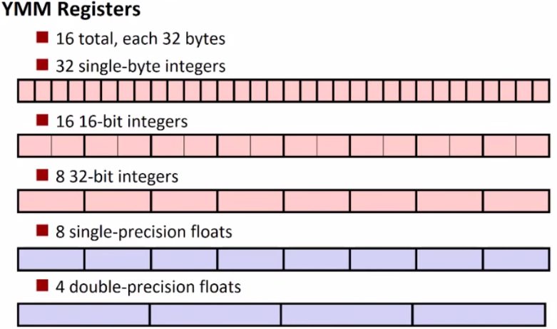
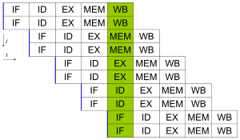
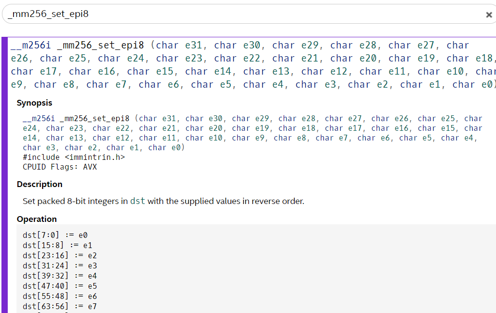

# Lab 8 - AVX2



The [advanced vector extensions](https://en.wikipedia.org/wiki/Advanced_Vector_Extensions) (AVX) are an instruction set for Intel (and AMD) machines that help us utilize the parallel processing(at the instruction level) capabilities of our modern [superscalar processor](https://en.wikipedia.org/wiki/Superscalar_processor). Today we are going to get some practice using a special instructions set! 


## Motivation

Put simply, a superscalar processor allows us to take what we have previously learned with pipelining and now fetch, decode, and execute more than 1 instruction at a time. The image below shows an example. 



> Simple superscalar pipeline. By fetching and dispatching two instructions at a time, a maximum of two instructions per cycle can be completed. (IF = Instruction Fetch, ID = Instruction Decode, EX = Execute, MEM = Memory access, WB = Register write back, i = Instruction number, t = Clock cycle [i.e., time]) [[source](https://en.wikipedia.org/wiki/Superscalar_processor)]

**Alright--let's begin!**

## Part 1 - Intrinsics (Background reading)

[Intrinsic functions](https://en.wikipedia.org/wiki/Intrinsic_function) are built-in functions within a compiler. They appear as functions, and when used within a programming language, generate the appropriate assembly automatically for us. Typically instrinics, or intrinsic functions, are provided to give some sort of specific optimization within a language.

The instrinsic functions for our compiler (either gcc or clang) are located in a header file named [immintrin.h](https://github.com/gcc-mirror/gcc/blob/master/gcc/config/i386/immintrin.h):

 ```c
 #include <immintrin.h> // Brings in the AVX Intrinsics
 ```

Navigating to `/lib/gcc/x86_64-redhat-linux/4.8.5/include/immintrin.h` you can actually see the contents of this file and where various intrinsic functions are implemented.

For AVX2 specifically, you will see:
```c
#ifdef __AVX2__
#include <avx2intrin.h>
#endif
```
You may further navigate to [avx2intrin.h](https://github.com/gcc-mirror/gcc/blob/master/gcc/config/i386/avx2intrin.h) and investigate the contents. Note, you will see within this header a message about whether or not it is okay to directly `#include <avx2intrin.h>`. :)

### Where to get more help

When learning something new, it is important to understand how to get help. For learning AVX2 instructions, it is handy to be able to look at the Intel Intrinsics guide here: https://software.intel.com/sites/landingpage/IntrinsicsGuide/#techs=AVX2

It will be helpful for you to search through the commands you encounter to see how they work.

In general three parts are provided:

1. A synoposis of the command (i.e. the name and arguments)
2. A description of what the command does.
3. The operation that is performed on the bits (i.e. where data is packed from source to destination of the 256 bits shown).



## Part 2 - AVX2 Pratice

Provided below is a listing of examples you should first work through. There are some questions and parts to fill in (i.e. some of the samples do not compile intentionally) to help you get some hands on experience with these commands.

The following exercises provided are:

* [avx1.c](./avx1.c) - Uncover the basics of packing bytes into an instruction
* [avx2.c](./avx2.c) - Build a print debugging function and learn about alignment.
* [avx3.c](./avx3.c) - Arithmetic operations
* [avx4.c](./avx4.c) - Understand masks
* [avx5.c](./avx5.c) - Permuting and rearranging data with masks

For each example, you will compile the code using: (e.g. `clang -std=c11 -mavx2 avx1.c -o avx1prog.S`) 

**Note** the `-mavx2` includes the avx2 functionality.

## Part 3 - AVX2 Exercises

By now you have had practice with the AVX2 instructions. Now attempt the following two exercises: [ex1.c](./ex1.c) and [ex2.c](./ex2.c).

For each of the exercises, you will be working with text-based data files. In case you've forgotten how to load data from a file, here is a short [tutorial](https://www.tutorialspoint.com/cprogramming/c_file_io.htm).

## Lab Deliverable

1. Complete [ex1.c](./ex1.c) - Load data, add 1 to each piece of data and print it out.
2. Complete [ex2.c](./ex2.c) - Decrypt a message (similiarly load data, add 1 to each value, but this time interpret as 'char' data)

## More Resources to Help

* Practical SIMD Programming: http://www.cs.uu.nl/docs/vakken/magr/2017-2018/files/SIMD%20Tutorial.pdf
* Intel Intrinsics guide: https://software.intel.com/sites/landingpage/IntrinsicsGuide/

## Going Further

- Perf is a profiler that can return information about the performance of your program. Measuring the performance of your system is the only true way to know if code changes and optimizations are making a difference. Run through the following commands to get an introduction to perf.
  - http://www.brendangregg.com/perf.html#OneLiners
- Try converting other pieces of sequential code to parallel and then benchmark with the `time` application. Note that it is not always clear when AVX instructions will perform faster.  
